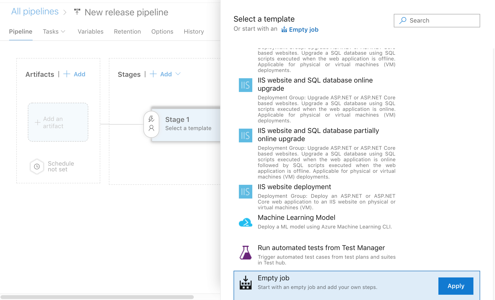
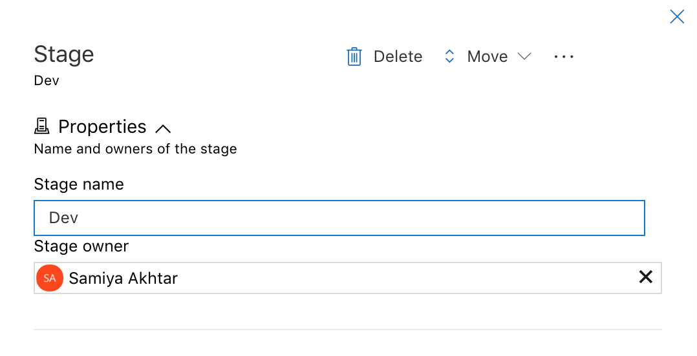
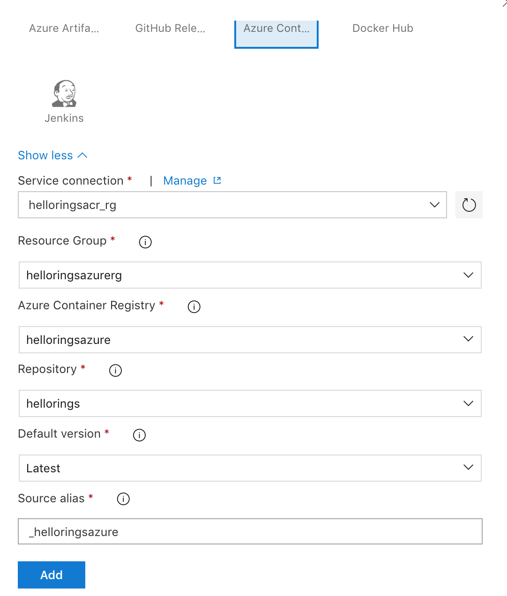
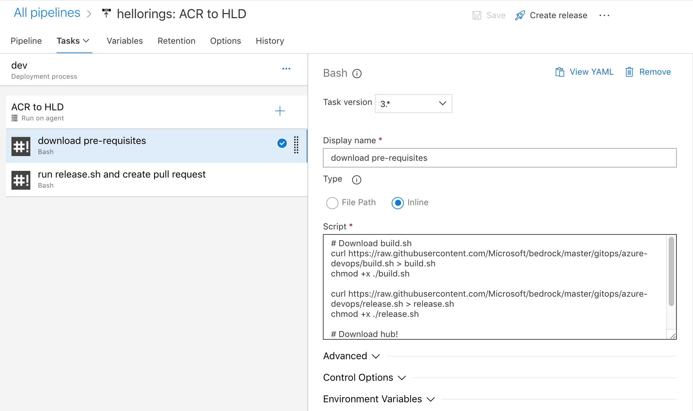
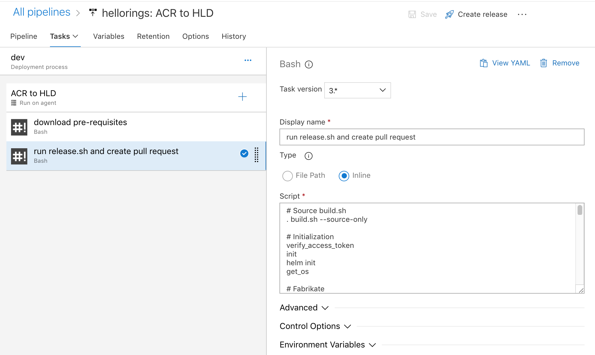
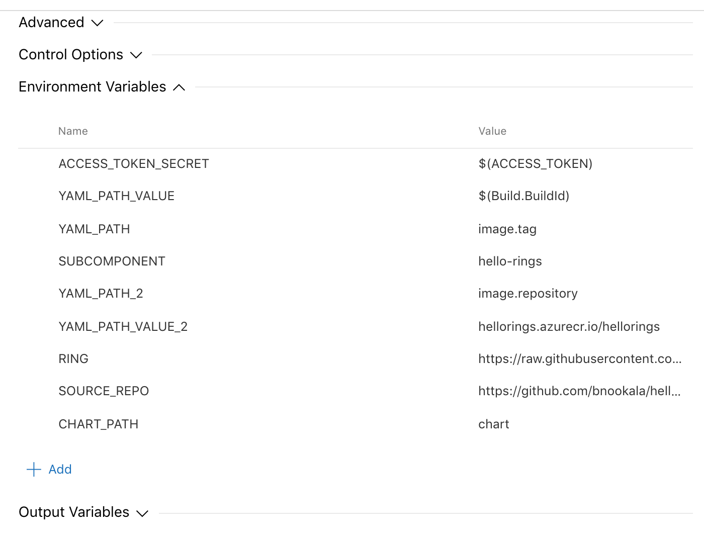

# Rings Implementation

This guide intends to implement Rings on Kubernetes without a Service Mesh using Azure DevOps. We recommend you review the [Rings](https://github.com/microsoft/bedrock-rings/blob/master/README.md) documentation to understand the design of this ringed model before attempting to implement it.

## Prerequisites

1. An Azure Container Registry (ACR)
2. A [Service Connection](https://docs.microsoft.com/en-us/azure/devops/pipelines/library/service-endpoints?view=azure-devops&tabs=yaml) established in Azure DevOps to access the ACR

## Implement the Rings Workflow

### 1. Source Repo to ACR (Image Tag Release Pt. 1)

This is the build pipeline in the [Image Tag Release](https://github.com/microsoft/bedrock/blob/master/gitops/azure-devops/ImageTagRelease.md) workflow, which is triggered off of commits made to the source repository, and builds and pushes a Docker image to the Azure container registry.

You may refer to our sample [hello world rings](https://github.com/bnookala/hello-rings) repository, which will be used throughout this guide.

Create a new `azure-pipelines.yml` file in the source repository like the following:

```yaml
trigger:
branches:
    include:
    - master
    - '*'
paths:
    include:
    - '*'

pool:
vmImage: 'ubuntu-latest'

steps:
- checkout: self
  persistCredentials: true
  clean: true

- task: Docker@2
  inputs:
    containerRegistry: '<name_of_the_service_connection_to_ACR_registry>'
    repository: '<name_of_the_repository>'
    command: 'buildAndPush'
    Dockerfile: '**/src/Dockerfile' # Path to the Dockerfile in your src repo
    tags: 'hello-rings-$(Build.SourceBranchName)-$(Build.BuildId)' # Use this format to have the tag name audit information forward for the next pipelines
  condition: ne(variables['Build.Reason'], 'PullRequest')
```

**Note:** The format used in image tags is structured a certain way to allow pipelines to extract information (e.g. branch name, build IDs). If you change this format, you may have to modify the subsequent pipelines to be able to retreive this information.

### 2. ACR to Cluster HLD (Image Tag Release Pt. 2)

This release pipeline is meant to be the second piece to the Image Tag Release. It is triggered when the ACR image is published and then used as an artifact. It accomplishes the following objectives:

- Download the `build.sh` script from the official Microsoft Bedrock repo
- Install prerequisites like [GitHub Hub](https://hub.github.com/), Azure CLI, and jq
- Clone the HLD repo
- Execute `fab set` to manipulate HLDs to update the new image tag build
- Execute `fab add` to add a ring, along with its metadata as a new subcomponent
- Open a pull request against the Cluster HLD repo to add the new ring component

1. First, create a new release pipeline using an 'Empty Job' template as the stage (e.g. Dev).

    

    

2. Add a new artifact by selecting Azure Container Registry that we're pushing to, in the previous step. If you haven not already setup the connections necessary to add this in your project settings, follow instructions [here](../azure-devops/ImageTagRelease.md#Create-a-service-connection-to-ACR).

    

3. Add two build steps to this pipeline. The first downloads the necessary prerequisites, and the second runs the [release script](https://github.com/microsoft/bedrock-rings/blob/master/rings-release.sh).

    - **GitHub**

        If you are using GitHub repositories,

        1. For the first build step, copy the following lines of code:

        ```sh
        # Download build.sh
        curl https://raw.githubusercontent.com/Microsoft/bedrock/master/gitops/azure-devops/build.sh > build.sh
        chmod +x ./build.sh

        # Download hub!
        sudo add-apt-repository ppa:cpick/hub
        sudo apt-get update
        sudo apt-get install hub
        ```

        

        2. Copy the contents of [`rings-release.sh`](https://github.com/microsoft/bedrock-rings/blob/master/rings-release.sh) and run it inline, or you can source and run the release script in the second task.

         

    - **Azure DevOps**

        If you are using Azure DevOps repos,

        1. Copy the following lines of code in a Bash task:

        ```sh
        # Download build.sh
        curl https://raw.githubusercontent.com/Microsoft/bedrock/master/gitops/azure-devops/build.sh > build.sh
        chmod +x ./build.sh

        # Download az CLI
        sudo apt-get update
        sudo apt-get install azure-cli
        az extension add --name azure-devops
        ```

        2. Copy the contents of [`rings-release.sh`](https://github.com/microsoft/bedrock-rings/blob/master/rings-release.sh).

            **NOTE:** Be sure to **comment** lines 83-85 and **uncomment** lines 89-92 to use the Azure CLI to create a pull request as opposed to using Hub.

4. Add the following environment variables to the second build step:
   - `REPO`: Set this to the name of the **Cluster HLD repository**
   - `SERVICE`: Set this to the name of the subcomponent that you are trying to update in the HLD
   - `YAML_PATH_VALUE`: Set this to `$(Build.BuildId)` so that it can be used to update the image tag built in the previous pipeline
   - `YAML_PATH`: Set this to the field which needs to be updated in the HLD, in this case `image.tag`
   - `YAML_PATH_2`: Set this to the second field updating in this step, in this case, the image repository `image.repository`
   - `YAML_PATH_VALUE_2`: Set this to the value for the image repository, such as `hellorings.azurecr.io/hellorings`
   **NOTE:** There can be as many `YAML_PATH` variables as necessary.
   - `SRC_REPO`: Set this to the URL for the source code repository, in this case `https://github.com/bnookala/hello-rings`
   - (*Azure DevOps only*) `ORG_NAME`: Set this to the organization URL in the format `https://dev.azure.com/org_name/`
   - (*Azure DevOps only*) `PROJECT_NAME`: Set this to the name of the project in your organization where the repository is hosted.

    

5. Run these steps from the very beginning, from the SRC to ACR pipeline, and shortly you should see a new release kick off for the newly built ACR image. Check the Cluster HLD Repo to see if there is a new pull request open.

Make sure that the SRC to ACR pipeline is triggered for all branches (not just master) to allow new rings to be pull requested.

### 3. Cluster HLD to Materialized Manifest

The Cluster HLD to materialized manifest pipeline should resemble Bedrock's [Manifest Generation Pipeline](https://github.com/microsoft/bedrock/blob/master/gitops/azure-devops/ManifestGeneration.md).

Add a new build pipeline for the Cluster HLD and place in the `azure-pipelines.yaml` the following code:

```yaml
trigger:
- master
- '*'

pool:
  vmImage: 'Ubuntu-16.04'

steps:
- checkout: self
  persistCredentials: true
  clean: true

- bash: |
    curl $BEDROCK_BUILD_SCRIPT > build.sh
    chmod +x ./build.sh
  displayName: Download Bedrock orchestration script
  env:
    BEDROCK_BUILD_SCRIPT: https://raw.githubusercontent.com/microsoft/bedrock/master/gitops/azure-devops/build.sh

- task: ShellScript@2
  displayName: Validate fabrikate definitions
  inputs:
    scriptPath: build.sh
  condition: eq(variables['Build.Reason'], 'PullRequest')
  env:
    VERIFY_ONLY: 1

- bash: |
    . build.sh
  displayName: Transform fabrikate definitions and publish to YAML manifests to repo
  condition: ne(variables['Build.Reason'], 'PullRequest')
  env:
    COMMIT_MESSAGE: $(Build.SourceVersionMessage)
    BRANCH_NAME: $(Build.SourceBranchName)
    REPO: "<URL of Materialized Manifest Repo"
```

In addition to the environment variables defined in teh `azure-pipelines.yaml`, this pipeline requires you have the following pipeline variables set:

- `ACCESS_TOKEN`: Set this to a personal access token that has write access to your repository
- `REPO`: Set this to the **Materialized Manifest** repository (e.g [hello-rings-materialized](https://github.com/bnookala/hello-rings-materialized))

As described in the [Rings Model](https://github.com/microsoft/bedrock-rings/blob/master/README.md) documentation, the idea of using a "Cluster HLD" is to have a repository that maintains the High Level Definition for **all** services and revisions that are intended to be run on the cluster.

The Cluster HLD will need to be modified by the user when a new service or a new ring (git branch) of a service is to be added. The new service/ring will be added as a subcomponent in the `component.yaml` file.
